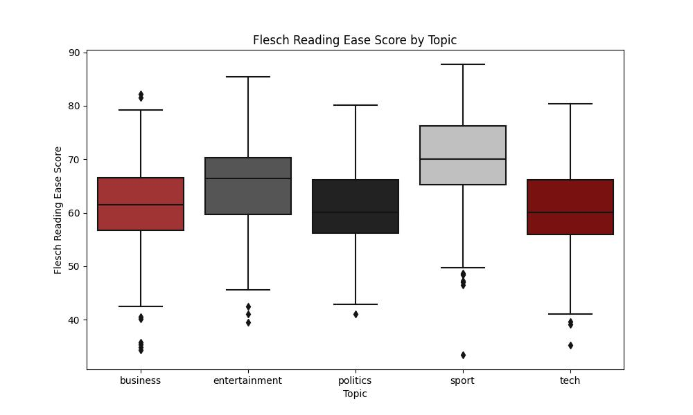
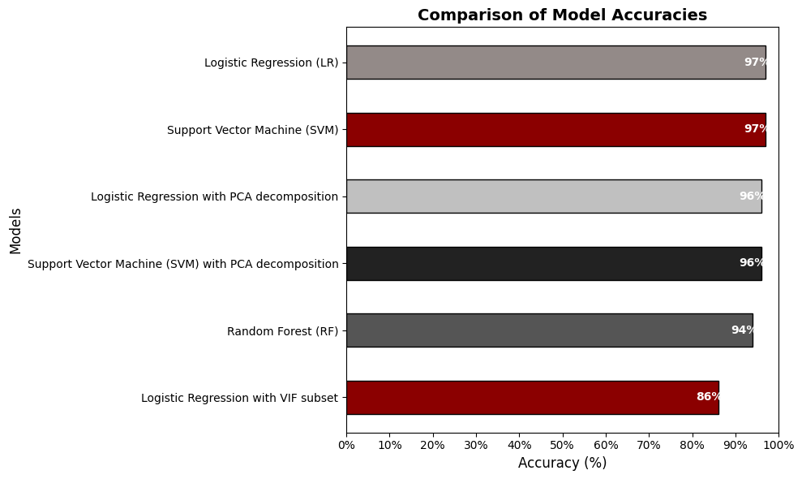

# Aggregating News Articles Using Text Classification


## Overview
This repository contains the implementation of a project aimed at **classifying and organizing news articles** using advanced machine learning and natural language processing (NLP) techniques. The project leverages models like Support Vector Machines (SVM), Random Forest, and Logistic Regression to categorize news articles into five predefined topics: Politics, Entertainment, Technology, Sports, and Business.

---

## Dataset

We used the **BBC News Classification** dataset from Kaggle:
- **Number of Records**: 2,127 articles.
- **Features**: 7 columns.
- **Topics**: Politics, Entertainment, Technology, Sports, Business.

### Data Preprocessing
- **Missing Values**: Replaced with median values.
- **Outliers**: Addressed via summarization features.
- **Duplicates**: Removed 69 duplicate records.
- **Cleaned Dataset**: Enhanced for better classification performance.

---

## Key Insights
### Complexity and Readability by Topic


- Articles in **Politics** and **Business** are more complex, while **Sports** articles are simpler and score higher on readability.
- Shorter articles are often more readable, while longer articles require more complex summarization.

---

## Machine Learning Models
The project explored three machine learning models: Logistic Regression, Random Forest, and Support Vector Machine (SVM). Each model underwent multiple iterations to optimize accuracy and address challenges like feature importance, overfitting, and scalability.

### Logistic Regression
Logistic regression was the first model used, leveraging the **LogisticRegression** class from Python's scikit-learn library. This discriminative model predicts the probability of a class by maximizing the likelihood of an instance belonging to a given class.  
Key highlights:
- The first iteration achieved an accuracy of **97.3%**, but concerns about overfitting arose due to over 30,000 features in the dataset.
- Feature importance was assessed, and features with low coefficient magnitudes were removed, reducing the dataset to 12,092 important features.
- Despite the streamlined feature set, the accuracy remained consistent at **97.3%**.  
The third iteration employed a **TF-IDF conversion** of the dataset, resulting in an accuracy of **95.63%**.

---

### Random Forest
Random Forest classifiers were constructed using **RandomForestClassifier()** from scikit-learn. This ensemble method builds multiple decision trees and aggregates their outputs to improve prediction accuracy.
Key highlights:
- The first iteration achieved an accuracy of **94.66%**, using 100 decision trees.
- A second iteration with the important features dataset improved accuracy to **97.90%**.
- A third iteration with the TF-IDF conversion resulted in an accuracy of **93.69%**.
- Hyperparameter tuning using **GridSearchCV()** optimized parameters, but accuracy stabilized at **93.69%**.

---

### Support Vector Machine (SVM)
SVMs classify data by identifying an optimal hyperplane that maximizes the margin between data points of different classes. For this multiclass classification problem, an **One-vs-Rest (OvR)** strategy was used with Python’s **LinearSVC** method.  
Key highlights:
- The first iteration achieved an accuracy of **97.25%**.
- The second iteration, using the important features dataset, retained the same accuracy.
- The third iteration with the TF-IDF dataset produced an accuracy of **95.63%**.

---
### Accuracy Comparison


---

## Deployment
### Streamlit Application
Click the image below to watch the demo video:

[](assets/demo_video.mp4)

The trained model and application are deployed using **Streamlit** for:
- Instant classification of newly uploaded data.
- A user-friendly interface for users.

---

## Limitations
1. Limited dataset size and one source of data (BBC News).
2. Constraints in equipment for large-scale processing.
3. Restricted to five predefined topic labels.

---

## Future Enhancements
- Expand dataset to include diverse news sources.
- Explore differences in precision and recall among various topic labels.
- Investigate words with high predictive power to refine model performance.

---

## Installation and Usage

### Prerequisites
- Python 3.8 or later
- Required libraries: `scikit-learn`, `pandas`, `numpy`, `matplotlib`, `seaborn`, `streamlit`

### Steps
1. Clone this repository:
   ```bash
   git clone https://github.com/your-username/aggregating-news-articles.git
2. Navigate to the project directory:
   ```bash
   cd aggregating-news-articles
3. Install dependencies:
   ```bash
   pip install -r requirements.txt
4. Run the Streamlit application:
   ```bash
   streamlit run app.py


